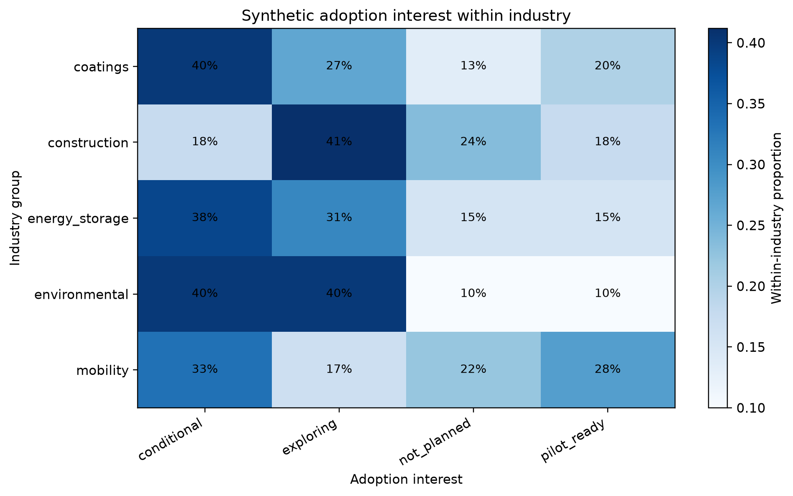
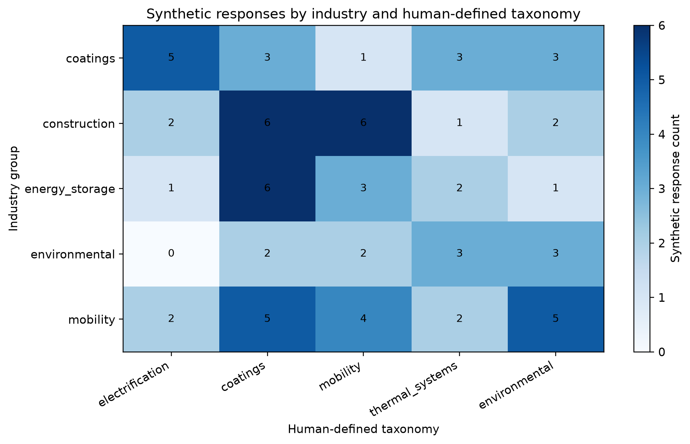
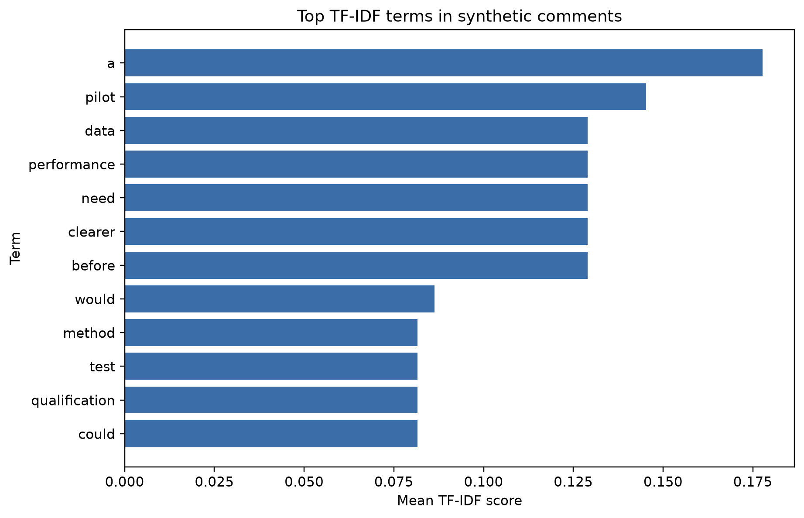
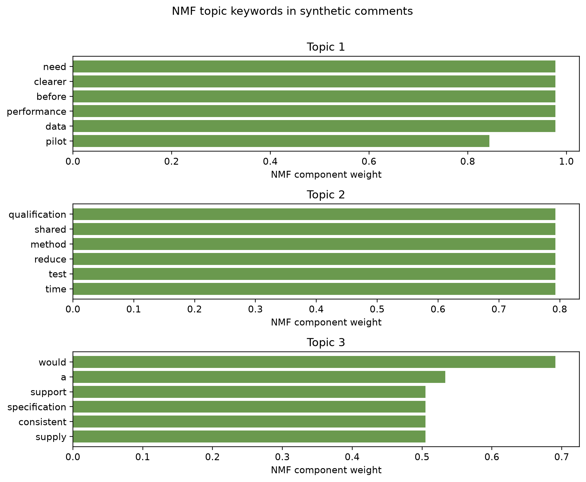
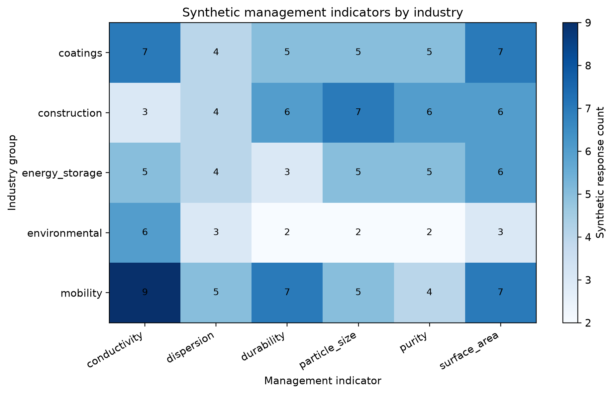

# Turquoise Hydrogen Demand NLP

A reproducible NLP workflow for structuring industrial demand and standardization needs related to turquoise-hydrogen-derived carbon materials.

This public repository uses a fully synthetic survey dataset generated from scratch with a fixed random seed. It demonstrates how structured survey items and free-text responses can be combined to identify interpretable demand themes across industrial application groups.

> **Synthetic data notice**
>
> All survey records in this repository are fully synthetic. No actual company names, respondent information, contact details, original survey responses, source documents, or real response distributions are included. Results should not be interpreted as estimates of the actual turquoise-hydrogen or carbon-material market.

## Research Question

**Can structured survey items and free-text industrial demand responses be transformed into reproducible, interpretable demand categories using lightweight NLP?**

## Workflow

The analysis pipeline combines structured survey summaries with exploratory text analysis:

1. Generate a deterministic synthetic survey dataset
2. Parse structured and multi-response survey fields
3. Compare industrial application groups
4. Extract important terms using TF-IDF
5. Identify exploratory text topics using non-negative matrix factorization (NMF)
6. Map responses to a predefined, human-interpretable demand taxonomy
7. Integrate structured survey variables and text-derived information
8. Produce summary tables and public-facing visualizations

The project intentionally separates:

- **Unsupervised topic modeling** — exploratory patterns learned from synthetic free-text responses
- **Demand taxonomy mapping** — predefined, transparent categories designed for interpretability

The two should not be interpreted as equivalent.

## Demand Taxonomy

The public demonstration organizes demand into broad categories such as:

- Material Properties
- Application Performance
- Testing & Standardization
- Commercialization
- Knowledge & Adoption

The taxonomy is human-defined and intended to demonstrate transparent structuring of qualitative industrial information rather than automatic ground-truth classification.

## Methods

The pipeline uses:

- Python
- pandas
- scikit-learn
- matplotlib
- TF-IDF vectorization
- NMF topic modeling
- rule-based taxonomy mapping
- grouped industry-level summaries
- multi-response parsing

Topic modeling is exploratory and is not used for statistical inference or market prediction.

## Example Results

> All figures below are generated from the fully synthetic demonstration dataset. They demonstrate the analytical workflow and should not be interpreted as actual market findings or evidence.

### Industry Adoption Patterns



This heatmap shows within-industry proportions across synthetic adoption-interest categories.

### Demand Taxonomy by Industry



This heatmap demonstrates how the human-defined demand taxonomy is distributed across synthetic industry groups.

### TF-IDF Terms



These bars show the highest overall TF-IDF terms found in the synthetic free-text comments.

### NMF Topic Keywords



These panels show the highest-weighted terms for each exploratory NMF topic without assigning substantive topic names.

### Management Indicators



This heatmap demonstrates multi-response parsing and grouped comparison of synthetic management indicators by industry.

## Project Structure

```text
turquoise-hydrogen-demand-nlp/
├── README.md
├── LICENSE
├── pyproject.toml
├── data/
│   ├── synthetic_survey.csv
│   ├── survey_schema.csv
│   └── demand_taxonomy.csv
├── figures/
│   ├── industry_adoption_heatmap.png
│   ├── industry_taxonomy_heatmap.png
│   ├── tfidf_top_terms.png
│   ├── nmf_topic_keywords.png
│   └── management_indicator_heatmap.png
├── scripts/
│   └── generate_synthetic_data.py
├── src/
│   └── demand_nlp/
│       ├── __init__.py
│       ├── analysis.py
│       ├── cli.py
│       └── visualization.py
└── tests/
    └── test_publication_safety.py
```

The `figures/` directory contains tracked public-facing visual outputs.

Generated intermediate analysis outputs are written to `outputs/`, which remains ignored by Git.

## Setup

```powershell
py -m venv .venv
.\.venv\Scripts\Activate.ps1

python -m pip install -e .
python -m pip install -e ".[test]"
```

Generate the synthetic dataset:

```powershell
python scripts/generate_synthetic_data.py
```

Run the analysis pipeline:

```powershell
turquoise-demand-nlp
```

Generate all public figures:

```powershell
python -m demand_nlp.visualization
```

Run the tests:

```powershell
pytest
```

## Reproducibility

Synthetic data generation uses the fixed random seed:

```text
20260927
```

This allows the public demonstration dataset and downstream analyses to be reproduced consistently.

Regression tests cover deterministic data generation, identifier uniqueness, schema validity, multi-response parsing, TF-IDF output, NMF topic generation, taxonomy validity, publication-safety constraints, and figure generation.

## Limitations

This repository is a methodological demonstration rather than an empirical market study.

In particular:

- the survey records are entirely synthetic
- synthetic category frequencies do not reproduce the original survey
- industry-level patterns are artificial demonstration outputs
- NMF topics are exploratory and depend on the generated corpus and preprocessing
- taxonomy assignments are based on explicit human-defined rules
- the workflow does not estimate market size, adoption probability, or commercial viability

## Background

The project was inspired by practical work involving industrial standardization-demand surveys for carbon materials associated with turquoise hydrogen.

The public version focuses on the methodological problem:

**how to transform mixed structured and qualitative industrial information into a reproducible and traceable analytical workflow.**

## License

MIT License.